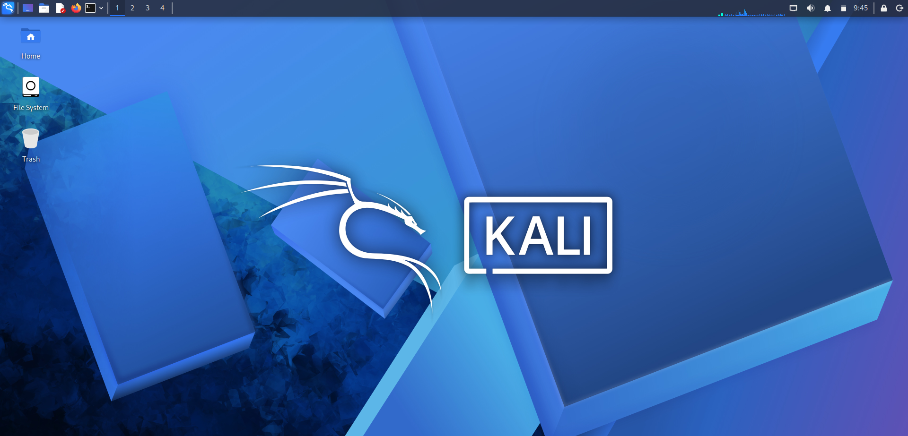
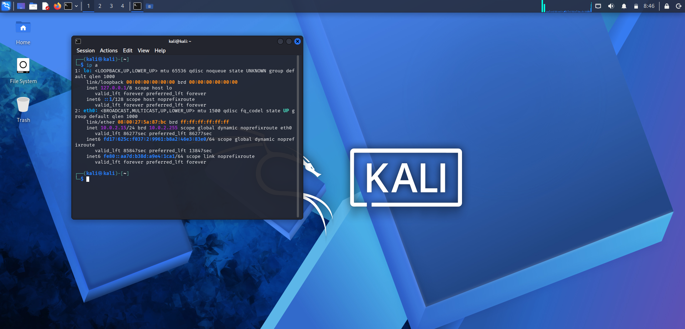

🔒 Cybersecurity Lab Environment Setup

**Building an isolated virtual lab for penetration testing and ethical hacking practice**

`Skill: Cybersecurity` `Ver: VirtualBox v7.2` `Kali Linux 2026.2` `Skill: Linux` `Network: 10.0.2.0/24` `Skill: Penetration Testing` `Skill: Virtualization` `GitHub`
`Kali Linux` `NetworkWalks` `Ethical Hacking` `Waqas Karim CCIE`

---

## 📌 Project Overview

This project focuses on setting up a **virtual cybersecurity and penetration-testing laboratory** using VirtualBox and Kali Linux.

The purpose of the lab is to create a controlled environment where cybersecurity tools, network scanning, reconnaissance, vulnerability assessment, and other security-testing activities can be performed safely and repeatedly.

The lab is configured on a private virtual network so that additional machines can be added later and used as targets for authorized security testing.

---

## 🛠️ Tools & Technologies Used

- **Hypervisor:** Oracle VirtualBox v7.2.16
- **Guest OS:** Kali Linux 2026.2 (Debian 64-bit based)
- **Host OS:** Windows
- **VM Specs:** 2048 MB RAM, 2 Processors, 80.09 GB Storage
- **Network Mode:** NAT (Intel PRO/1000 MT Desktop Adapter)

---

## 📋 Steps Performed

1. Downloaded and installed **Oracle VirtualBox v7.2.16** on the host machine.
2. Downloaded the **Kali Linux 2026.2** VM image from the official Kali website.
3. Imported the Kali Linux VM into VirtualBox and configured VM settings (2048 MB RAM, 2 CPU cores, 80.09 GB storage).
4. Configured the network adapter (NAT mode) for internet access inside an isolated lab environment.
5. Started the Kali Linux VM and completed the first boot.
6. Logged into the Kali Linux desktop environment.
7. Opened a terminal and ran `ip a` to verify network connectivity and confirm the assigned IP address (private lab range).
8. Captured screenshots at each stage for documentation purposes.

---

## 🖼️ Screenshots

**1. VM Configuration Details**

*Shows the Kali Linux VM setup — Debian (64-bit), 2048 MB RAM, 2 Processors, 80.09 GB storage, and NAT network adapter.*

**2. VirtualBox Version Verification**

*Confirms Oracle VirtualBox v7.2.16 installed on the host machine.*

**3. Kali Linux Boot Screen**

*Kali Linux successfully booting inside the VirtualBox environment.*

**4. Network Verification (Terminal)**

*Terminal output of `ip a` command confirming the Kali VM is connected to the isolated lab network with a private IP address.*

---

## ⚠️ Troubleshooting Experience

**Problem faced:** Initially had difficulty capturing screenshots from inside the Kali Linux VM.

**Solution:** Used VirtualBox's built-in **View → Take Screenshot** feature, and also used the Windows **Snipping Tool (Windows + Shift + S)** as an alternative method to capture the VM window directly from the host machine. This avoided quality issues from external camera photos.

---

## 📚 Learnings

- Understood how to set up an isolated virtual lab environment using VirtualBox.
- Learned how to import and configure a Kali Linux VM (RAM, CPU, storage, network).
- Learned how NAT networking works for isolated lab environments.
- Verified network configuration using Linux terminal commands (`ip a`).
- Learned proper methods for capturing clean VM screenshots for documentation.

---

## 🔗 Related Links

- Instructor: [Waqas Karim CCIE](https://linkedin.com/in/waqaskarim/)
- Organization: [NETWORKWALKS](https://linkedin.com/company/networkwalks/)
- Program: NetworkWalks Cybersecurity Internship Program

---

## ⚖️ Disclaimer

This lab setup is for **educational and research purposes only**, performed in a self-owned, isolated virtual environment. No unauthorized access or testing was performed on any external systems.
